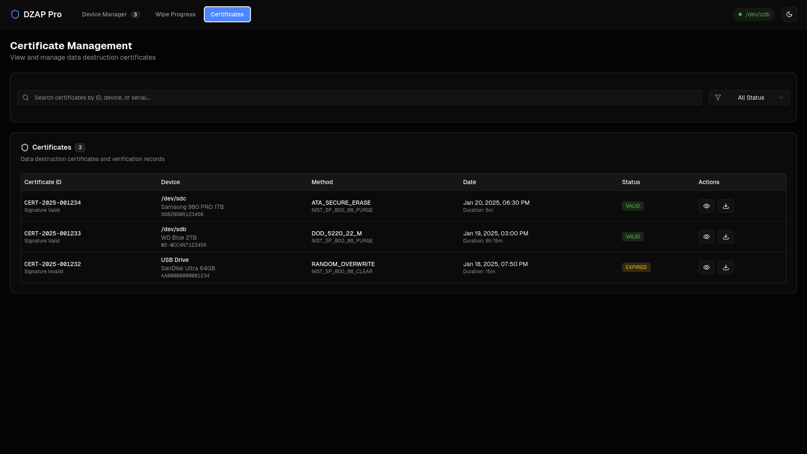

# DZap: Secure Drive Wiper

    

**DZap** is a cross-platform utility designed to securely sanitize storage media (HDDs, SSDs, NVMe, USBs) to NIST 800-88 standards.

> **WARNING:** This software is designed to **permanently and irretrievably destroy data**. Use with extreme caution. The developers are not responsible for accidental data loss.

---

## Screenshots




---

## Key Features

* **Modern Tech Stack:** Built with **Electron, React, & Tailwind CSS** for a responsive UI, backed by **Go** for high-performance hardware interaction.
* **NIST 800-88 Compliance:**
    * **Clear:** 1-pass and 3-pass overwrite algorithms for HDDs.
    * **Purge:** Firmware-based `ATA Secure Erase` and `NVMe Format` for modern SSDs.
* **Secure Architecture:** Uses a **Privileged Helper** pattern. The UI runs as a standard user, while the backend runs securely via Linux PolicyKit (`pkexec`) only when necessary.
* **Certified Destruction:** Generates a verifiable HTML/PDF certificate upon successful completion.
* **Hot-Plug Support:** Automatically detects drives connected via USB or SATA/NVMe interfaces.

---

## Prerequisites

Before installing, ensure your Linux system has the following dependencies:

  * **Runtime Tools:** `smartmontools`, `hdparm`, `nvme-cli`, `polkit`
  * **Build Tools:** `go` (v1.21+), `npm` / `node`, `gcc`
  * **AI Runtime:** `libonnxruntime` (often available as `onnxruntime` or `libonnxruntime-dev`) (Disabled for now)

**Arch Linux:**

```bash
sudo pacman -S go npm smartmontools hdparm nvme-cli onnxruntime
```

**Ubuntu/Debian:**

```bash
sudo apt install golang nodejs npm smartmontools hdparm nvme-cli libonnxruntime-dev
```

-----

## Installation & Build

Because DZap uses a system-level backend service, installation is a two-step process.

### 1\. Build the Application

Clone the repository and build the source code.

```bash
npm install
npm install cross-env --save-dev
npm run start:frontend
```

In another terminal run:

```bash
cd server
sudo go run .
```

### 2\. Install the Backend Helper

Run the provided installer script. This copies the Go binary to a secure system location (`/usr/local/bin`) and installs the PolicyKit rules allow the UI to communicate with it.

```bash
sudo ./install.sh
```

-----

## Usage

Once installed, you can run the application like any other Linux program.

1.  Navigate to the `dist/` folder (or wherever you moved the AppImage).
2.  Run the application:
    ```bash
    ./DZap\ Secure\ Wiper-1.0.0.AppImage
    ```
    *(Note: You do NOT need `sudo` to run the AppImage).*
3.  When the backend needs to start (usually immediately upon launch), the system will prompt you for your password via a secure GUI dialog.

-----

## Development

For developers contributing to DZap, use the development mode which enables hot-reloading.

**Recommended Workflow:**

1.  **Terminal 1 (Backend):**
    ```bash
    cd server
    sudo go run .
    ```
2.  **Terminal 2 (Frontend):**
    ```bash
    npm run start:frontend
    ```

-----

## Project Structure

```
DZap/
├── electron/          # Main process logic (window creation, IPC)
├── frontend/          # React UI (Tailwind, Components, State)
├── server/            # Go Backend
│   ├── api/           # HTTP Handlers
│   ├── core/          # Drive detection, Wiping logic, AI prediction
│   └── realtime/      # WebSocket hub
├── model/             # ONNX AI models and feature maps
└── install.sh         # System installer script (In Development)
```

-----

## Contributing

Contributions are welcome\! Please follow these steps:

1.  Fork the repository.
2.  Create a feature branch (`git checkout -b feature/AmazingFeature`).
3.  Commit your changes (`git commit -m 'Add some AmazingFeature'`).
4.  Push to the branch (`git push origin feature/AmazingFeature`).
5.  Open a Pull Request.

-----

## License

Distributed under the MIT License. See `LICENSE` for more information.
